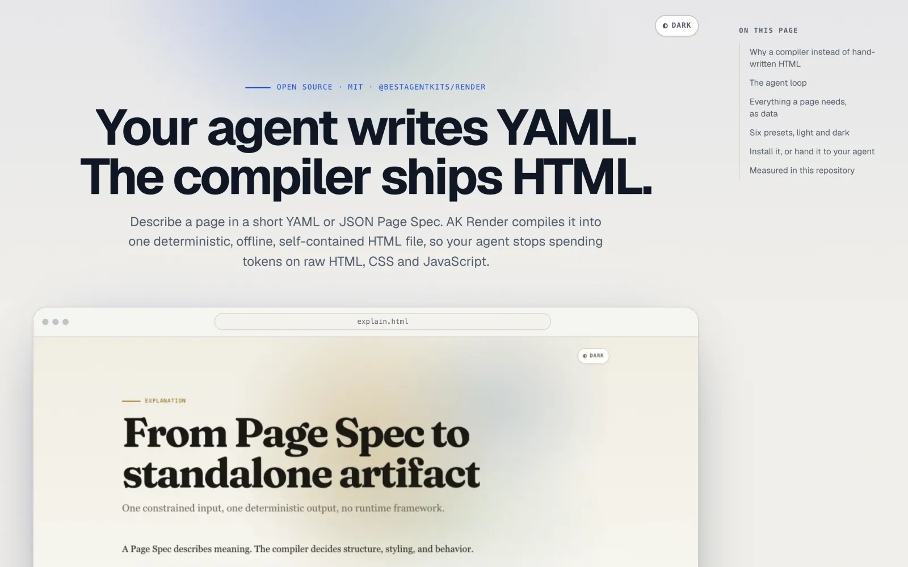

# @bestagentkits/render

A declarative page compiler for coding agents. An agent writes a short YAML or
JSON **Page Spec**; `ak-render` compiles it into one deterministic,
self-contained, interactive **HTML file**.

[](https://render.agentkit.best)

**[render.agentkit.best](https://render.agentkit.best)** · [Gallery](https://render.agentkit.best/gallery/) · [Agent guide](./docs/agent-guide.md) · [npm](https://www.npmjs.com/package/@bestagentkits/render)

Agents describe meaning and composition. The compiler owns HTML, CSS,
interaction, accessibility, responsive layout, theming, fonts, security policy
and byte-for-byte determinism. The agent spends tokens on the content instead
of on markup, and the result looks designed every time.

- **Offline by default.** The file opens from disk (`file://`) and makes zero
  network requests. Fonts are embedded; nothing loads from a CDN.
- **Deterministic.** The same spec and compiler version produce the same bytes.
- **No escape hatch.** A spec cannot carry raw HTML, CSS or JavaScript, so a
  page cannot drift off the design system or smuggle in a script.
- **Local is canonical.** No account, no server, no API key.

## Quick start

Requires Node.js >= 20.11.

1. Write a spec, `plan.yaml`:

   ```yaml
   version: 1
   meta:
     title: Migration plan
     description: How we move the API to the new gateway.
   theme:
     preset: editorial
   blocks:
     - type: hero
       eyebrow: Plan
       title: Migration plan
       description: Move the public API to the new gateway without downtime.
     - type: section
       title: Steps
       blocks:
         - type: steps
           items:
             - title: Mirror traffic
               text: Send a copy of production requests to the new gateway.
             - title: Switch reads
               text: Route read endpoints once error rates match.
     - type: callout
       tone: info
       title: Rollback
       text: Point DNS back to the old gateway; no data migrates.
   ```

2. Validate it, then compile it:

   ```bash
   npx -y @bestagentkits/render validate plan.yaml
   npx -y @bestagentkits/render plan.yaml --out plan.html
   ```

3. Open `plan.html` in any browser. It is one file you can attach, email or
   commit.

## Usage guide

### Find the blocks you need

There are 54 block types, from primitives (`section`, `grid`, `split`, `text`)
to semantic blocks that carry the design for you (`hero`, `steps`, `timeline`,
`comparison`, `kpi`, `chart`, `terminal`, `bento`, `cta`). List them, then read
the full contract of the ones you use:

```bash
ak-render catalog                # every block and action, one line each
ak-render describe timeline      # props, defaults, bounds, slots, a11y notes
ak-render describe kpi --json    # the same, machine-readable
```

Containers (`section`, `grid`, `split`, `stack`) take their children under
`blocks:`.

### Validate and fix

```bash
ak-render validate plan.yaml --json
```

The result is `{ ok, diagnostics[] }`. Each diagnostic has a stable `code` and
the JSON `path` to fix, such as `$.blocks[1].blocks[0].items[2].title`. Exit
code `1` means "fix and retry"; `2` means the input could not be read or the
output could not be written.

### Compile

```bash
ak-render plan.yaml --out plan.html            # compile is the default command
ak-render plan.yaml --out plan.html --json     # print bytes, hash, features, warnings
ak-render - --out plan.html < plan.yaml        # read the spec from stdin
ak-render plan.yaml --theme blueprint          # override the spec's theme
```

### Themes

Six built-in presets, each with a light and a dark scheme and an embedded
display face: `blueprint`, `editorial`, `paper-ink`, `swiss-clean`,
`terminal-mono` and `warm-signal`. Pick one under `theme.preset`, or extend one
with validated tokens:

```yaml
theme:
  preset: team-theme
  extends: editorial
  tokens:
    color-accent: "#b8860b"
    motion-policy: none     # a still page, as under reduced motion
```

`ak-render themes` lists the presets it can see, including project and user
presets. See [docs/themes.md](./docs/themes.md).

### Interaction

Tabs, accordions, carousels, sliders, dialogs, filters, copy buttons and the
theme toggle come from a small trusted runtime. A spec wires them with a closed
set of declarative actions (`ak-render catalog` lists them); there is no
JavaScript field. Every page reads completely with scripts off, with motion
reduced, in print and in a screenshot.

### Images, video and the network

Local paths (`assets/shot.png`) always work. A remote URL renders as a labelled
fallback with a link unless the spec opts in. A remote video `poster` is the
exception: it has no fallback, so `validate` rejects it at its own path until
the page allows remote `images`:

```yaml
policy:
  network:
    allow: [images, media]
```

The page's Content Security Policy is derived from that policy. See
[docs/media-policy.md](./docs/media-policy.md).

## Use it from an agent

Agents follow one loop: `catalog` once, `describe` the blocks they use,
`validate` and fix diagnostics by JSON path, then compile. The
[agent guide](./docs/agent-guide.md) has the details and [llms.txt](./llms.txt)
is the LLM-facing index.

### Install the agent skill

The `ak-render` skill ([skills/ak-render/SKILL.md](./skills/ak-render/SKILL.md))
teaches an agent that loop.

**Any agent**, with the [skills CLI](https://github.com/vercel-labs/skills):

```bash
npx skills add bestagentkits/ak-render
```

**Claude Code**, as a plugin that also registers the MCP server:

```bash
claude plugin marketplace add bestagentkits/ak-render
claude plugin install ak-render@ak-render
```

**Codex and ChatGPT**, as a plugin:

```bash
codex plugin marketplace add bestagentkits/ak-render
codex plugin add ak-render@ak-render
```

### MCP server

`ak-render mcp` serves `catalog`, `describe`, `validate`, `render` and `themes`
as MCP tools over stdio. `render` writes the HTML to disk and returns only a
summary, so the page never enters the agent's context.

```json
{
  "mcpServers": {
    "ak-render": { "command": "npx", "args": ["-y", "@bestagentkits/render", "mcp"] }
  }
}
```

## Token cost

The compiled page goes to disk, never through the model. What the agent pays
is guidance it reads, the spec it writes, and a one-line summary it reads back.

| Part of a page task | Hand-written HTML | AK Render |
| --- | ---: | ---: |
| Presentation guidance read | 33.7k (baseline mean) | 5.7k (skill, catalog, describe) |
| Written by the agent | 13.9k (median legacy page) | 6.9k (projected spec) |
| Returned into context | the written page is already there | 0.1k (render summary) |
| **Total, estimated** | **47.5k** | **12.7k (−73%)** |

- **Benchmarked:** presentation context drops 87–88%, from 33.7k–36.6k tokens
  of legacy guidance to 4.4k
  ([render benchmark](./docs/artifacts/benchmark-render.md)).
- **Measured on 12 HTML pages agents wrote in real projects:** a median of 26%
  of each page is visible text; the rest is markup, CSS and script. The
  projected median output saving is 54%. A page that is mostly prose saves
  little or nothing: one of the twelve grew by 29%.
- **Not measured yet:** live model token counts, repair loops, wall time and
  output quality.

Characters are measured; tokens are estimated at 4 characters per token. Method
and per-page data: [agent token cost](./docs/artifacts/agent-token-cost.md),
produced by `benchmarks/agent-token-cost.mjs`.

## Design in one screen

```text
Page Spec (JSON/YAML, authored by a model)
   |  parse -> validate -> normalize
   v
internal IR (flat nodes, stable content-derived IDs)
   |  resolve registry -> resolve theme -> render
   v
single self-contained HTML document
   |  collect used assets/runtime features -> assemble -> verify
   v
deterministic artifact (opens from file://, zero network by default)
```

Six decisions define the boundary, argued in
[ADR 0001](./docs/adr/0001-page-spec-compiler-boundary.md):

1. **Page Spec is authoring; the IR is compiler-internal.** The nested,
   model-friendly spec normalizes into a flat node graph with stable IDs for
   rendering, future diff/patch/editor tooling, and MCP surfaces.
2. **Catalog and registry are separate.** `catalog()` is compact and cheap;
   `describe(type)` carries the full contract. Discovery stays out of the token
   budget until a block is actually selected.
3. **The interaction runtime is trusted and declarative.** A closed action
   vocabulary, one small event-delegation script, native HTML controls first,
   and only the feature modules a page uses.
4. **Themes are typed data, never CSS.** Built-in presets plus user presets that
   `extends` them. No CSS escape hatch, no CDN fonts.
5. **Local is canonical; cloud is opt-in.** The hosted renderer reuses the same
   compiler and is never the source of truth.
6. **Optional capabilities arrive as adapters.** Diagrams can delegate to an
   installed diagram compiler; without one, a structured fallback renders.

## Install as a dependency

```bash
pnpm add @bestagentkits/render
```

## Library API

```ts
import {
  render,
  validate,
  normalize,
  catalog,
  describe,
  loadTheme,
} from '@bestagentkits/render';
```

| Export | Purpose | Status |
| --- | --- | --- |
| `VERSION` | Package version, matching `package.json` | Available |
| `RenderError`, `isRenderError` | Stable error codes with JSON path and node ID | Available |
| `render(spec, options)` | Compile a spec to a standalone HTML artifact | Available |
| `validate(spec)` | Report spec diagnostics without rendering | Available |
| `normalize(spec)` | Produce the flat internal IR | Available |
| `catalog()` | Compact list of available blocks and actions | Available |
| `describe(type)` | Full machine-readable contract for one entry | Available |
| `loadTheme(input)` | Validate and resolve a theme preset | Available |
| `buildThemeCatalog(options)` | Discover built-in, user, project, and explicit presets | Available |

## CLI reference

```bash
ak-render page.yaml --out page.html
ak-render - --out page.html < page.yaml   # read the spec from stdin
ak-render validate page.json
ak-render catalog
ak-render describe carousel
ak-render themes
ak-render mcp                             # MCP server over stdio

ak-render <command> --help
ak-render --version
```

Every command accepts `--json` and never prompts.

## Fixtures and snapshots

`fixtures/pages/` holds the representative corpus the compiler is built
against: plan, explain, recap, diff, dashboard, media, interactive, and theme
showcase pages. `fixtures/snapshots/` holds one committed artifact per built-in
preset. See [fixtures/README.md](./fixtures/README.md) and
[docs/themes.md](./docs/themes.md). Fixtures are the specification: a new
capability is not done until a fixture exercises it.

## Repository layout

| Path | Contents |
| --- | --- |
| `src/` | Library and CLI source |
| `tests/unit/` | Vitest unit and contract tests |
| `tests/browser/` | Playwright browser tests, including the zero-network audit |
| `fixtures/` | Representative Page Spec corpus and committed cross-preset snapshots |
| `benchmarks/` | Reproducible measurement harnesses |
| `docs/adr/` | Architecture decision records |
| `docs/artifacts/` | Captured measurements and evidence |
| `skills/`, `.claude-plugin/`, `.agents/plugins/`, `plugin.json`, `mcp.json` | Agent skill and plugin manifests |
| `assets/` | Embedded font licences and the plugin icon (`icon.svg` is the source of `logo.png` and `composer-icon.png`) |
| `site/` | Landing page spec, build script output and Cloudflare config |
| `apps/cloud/` | Opt-in Cloudflare renderer (cloud milestone) |

## Development

```bash
pnpm install
pnpm verify          # lint + typecheck + unit tests + build
pnpm test:browser    # Playwright, after: pnpm exec playwright install chromium
pnpm test:package    # pack, install into a temp project, exercise API and bin
pnpm bench:baseline  # re-run the legacy presentation-context measurement
pnpm site:build      # compile the landing page and gallery into site/dist
pnpm site:deploy     # build, then deploy site/dist with wrangler
```

See [CONTRIBUTING.md](./CONTRIBUTING.md) for the determinism, trust, and testing
rules that changes are reviewed against, and
[docs/release-policy.md](./docs/release-policy.md) for versioning.

## Security

Spec input is untrusted. Report vulnerabilities privately through GitHub's
security advisory flow; see [SECURITY.md](./SECURITY.md) for the threat model and
the invariants the compiler must hold.

## License

MIT — see [LICENSE](./LICENSE).
